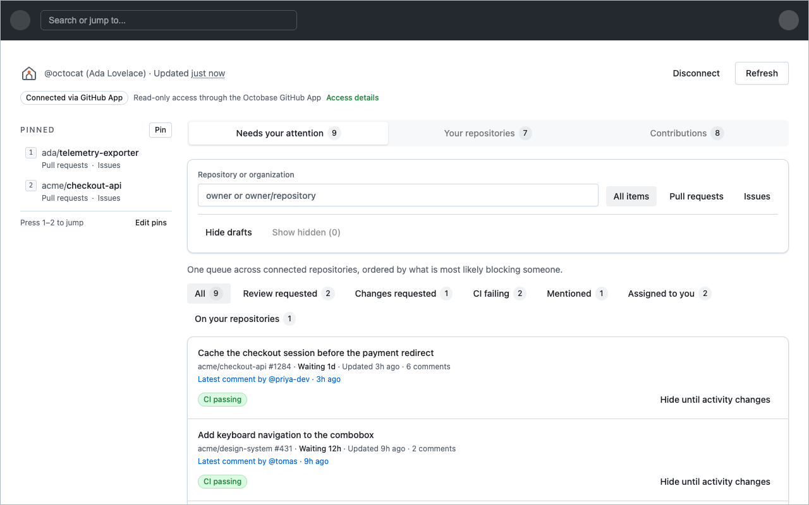

# Octobase

Replacement for the GitHub homepage, as a browser extension. It keeps GitHub's own header and
navigation, and replaces the feed below it with a read-only dashboard of the work waiting on you.

<a href="https://chromewebstore.google.com/detail/octobase/mgipbfmankhlkpeioipbgibidppifnec"></a>
<a href="https://apps.apple.com/us/app/octobase/id6805298048?mt=12"></a>

**Safari via Homebrew:** `brew install --cask saadjs/tap/octobase`



- Review-requested pull requests across every repository you can reach.
- Your open pull requests, with aggregate CI status.
- Assigned open issues, pinned repositories, and keyboard jumps back into GitHub.
- Snapshots cached in IndexedDB, so the dashboard paints before GitHub answers.

## Install

To build and install locally:

```sh
pnpm install
pnpm build            # Chrome / Edge  → .output/chrome-mv3
pnpm build:firefox    # Firefox        → .output/firefox-mv3
pnpm build:safari     # Safari         → .output/safari-mv3
```

**Chrome / Edge**: open `chrome://extensions`, turn on **Developer mode**, click **Load unpacked**,
and select `.output/chrome-mv3`.

**Firefox**: open `about:debugging#/runtime/this-firefox`, click **Load Temporary Add-on**, and
select `manifest.json` inside `.output/firefox-mv3`. Temporary add-ons are cleared on restart.

**Safari**: run `pnpm open:safari` to build and generate the Xcode project. Select the
**Octobase** scheme, choose **My Mac**, and click **Run**. The first time, select your Apple
Developer team under **Signing & Capabilities**. Enable Octobase under **Safari → Settings →
Extensions**.

Then open [github.com](https://github.com) and connect your account from the dashboard.

## Connecting

Octobase authenticates with the public **Octobase** GitHub App over device flow. Click **Connect**,
enter the code GitHub shows you, and install the app on the repositories you want covered. The
token is held by the extension's background service worker and is never exposed to the page.

A fine-grained or classic personal access token works too, if you would rather not install an App.

## Develop

```sh
pnpm install
pnpm dev              # Chrome
pnpm dev:firefox
pnpm open:safari      # Build, generate, and open the macOS Xcode project
pnpm check:safari     # Build the generated native wrapper without signing
pnpm check            # format + lint + typecheck + test
pnpm test:e2e         # Playwright, against the real build output
```

## Release Safari

Create a signed App Store archive with a new integer build number:

```sh
APPLE_TEAM_ID=YOURTEAMID APPLE_BUILD_NUMBER=2 pnpm archive:safari
open .output/safari-archive/Octobase.xcarchive
```

In Xcode Organizer, validate the archive and distribute it through **App Store Connect**. Increment
`APPLE_BUILD_NUMBER` for every upload, including retries of the same marketing version. The Safari
wrapper is generated into `.output/`; rerun `pnpm package:safari` rather than editing it by hand.

## License

[MIT](LICENSE)
