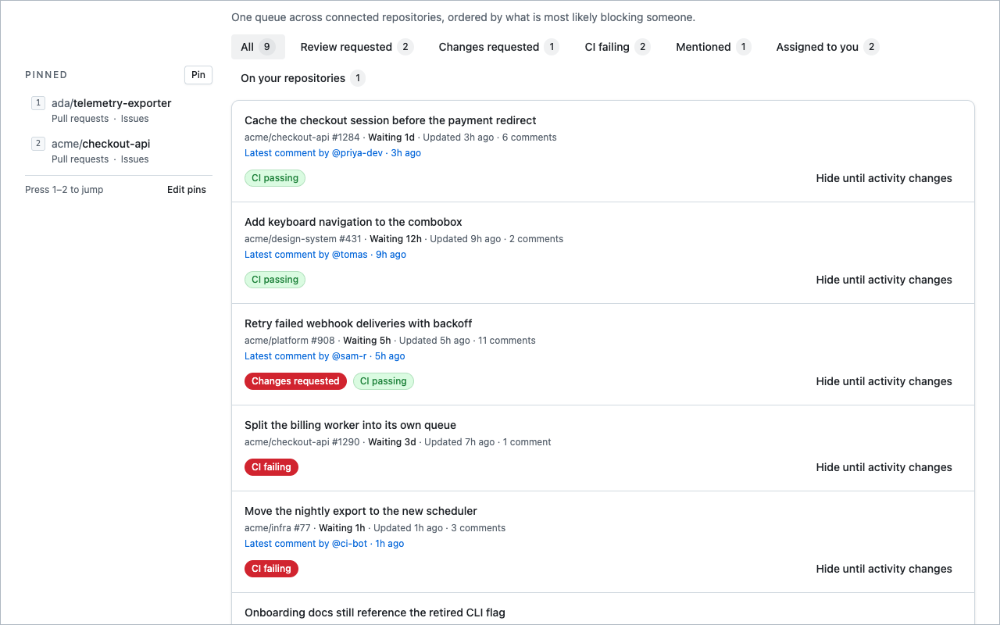
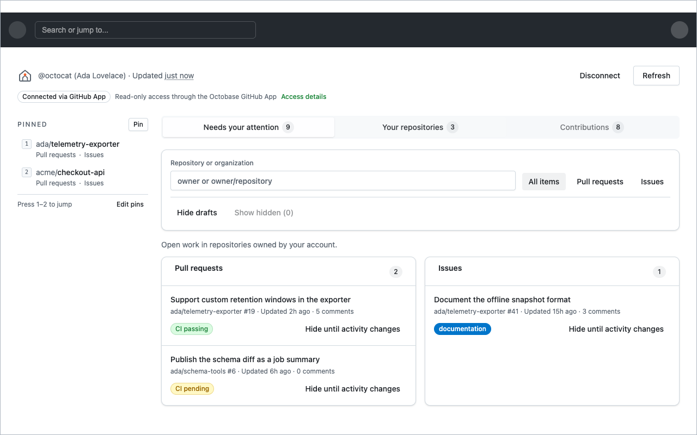

# Replacement for the GitHub homepage

Stay on top of review requests, pull requests, assigned issues, and pinned repositories without
leaving GitHub.

  <a class="store-button" href="https://chromewebstore.google.com/detail/octobase/mgipbfmankhlkpeioipbgibidppifnec" aria-label="Install Octobase from the Chrome Web Store">
    
    
      Available in the
      <strong>Chrome Web Store</strong>
    
  </a>
  

    
      Safari via Homebrew
      <code>brew install --cask saadjs/tap/octobase</code>
    
  

<picture>
  <source srcset="screenshots/01-attention-dark.png" media="(prefers-color-scheme: dark)" />
  
</picture>

<picture>
  <source srcset="screenshots/02-queue-dark.png" media="(prefers-color-scheme: dark)" />
  
</picture>

<picture>
  <source srcset="screenshots/03-repositories-dark.png" media="(prefers-color-scheme: dark)" />
  
</picture>

- [Privacy Policy](privacy-policy.md)
- [Source on GitHub](https://github.com/saadjs/octobase)
